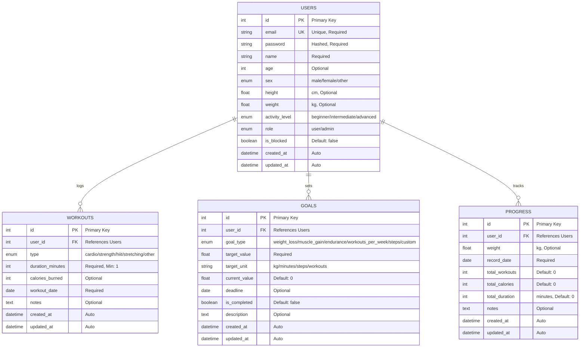

# Entity Relationship Diagram (ERD)

## Fitness Tracker Database Schema

## Table Relationships

### One-to-Many Relationships

1. **Users → Workouts**
   - One user can have many workout entries
   - Each workout belongs to exactly one user
   - Cascade delete: deleting user removes all workouts

2. **Users → Goals**
   - One user can set multiple fitness goals
   - Each goal belongs to exactly one user
   - Cascade delete: deleting user removes all goals

3. **Users → Progress**
   - One user can have multiple progress records
   - Each progress entry belongs to exactly one user
   - Cascade delete: deleting user removes all progress

## Data Types & Constraints

### ENUM Values

| Field | Values |
|-------|--------|
| sex | male, female, other |
| activity_level | beginner, intermediate, advanced |
| role | user, admin |
| workout.type | cardio, strength, hiit, stretching, other |
| goal.goal_type | weight_loss, muscle_gain, endurance, workouts_per_week, steps, custom |

### Constraints

- `email`: Unique, valid email format
- `password`: Minimum 6 characters, stored as bcrypt hash
- `duration_minutes`: Minimum 1
- `calories_burned`: Minimum 0
- `height`: Between 100-250 cm
- `weight`: Between 30-300 kg
- `age`: Between 10-120
