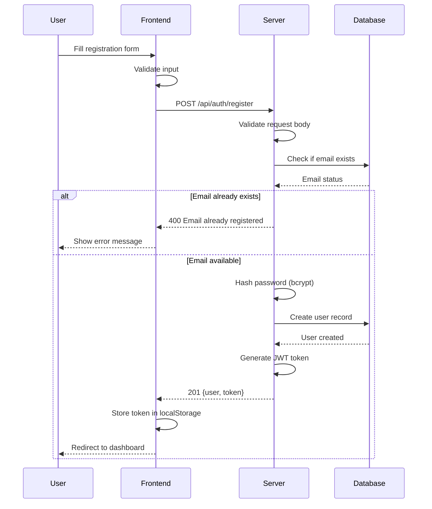
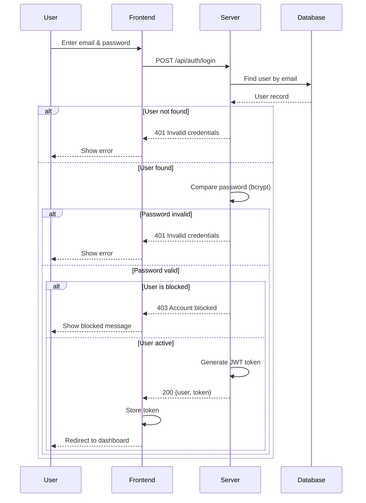
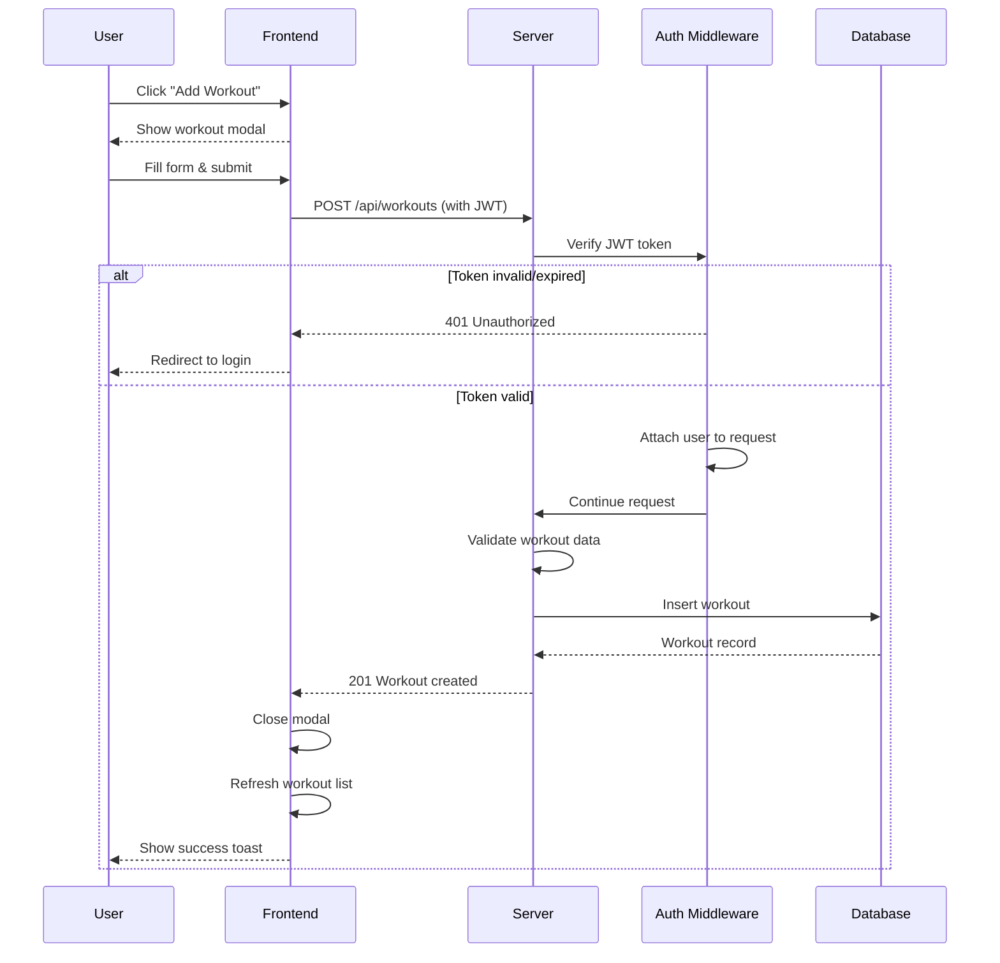
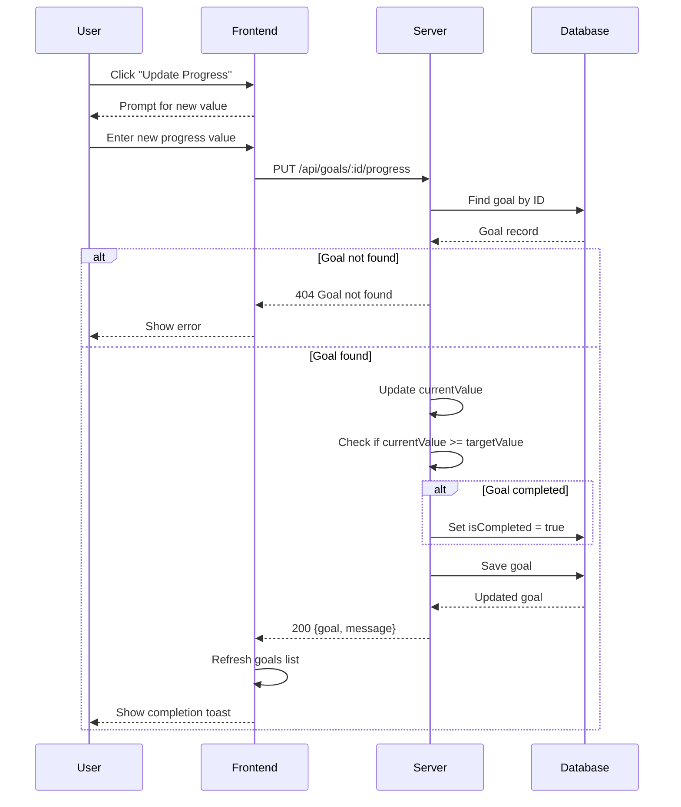
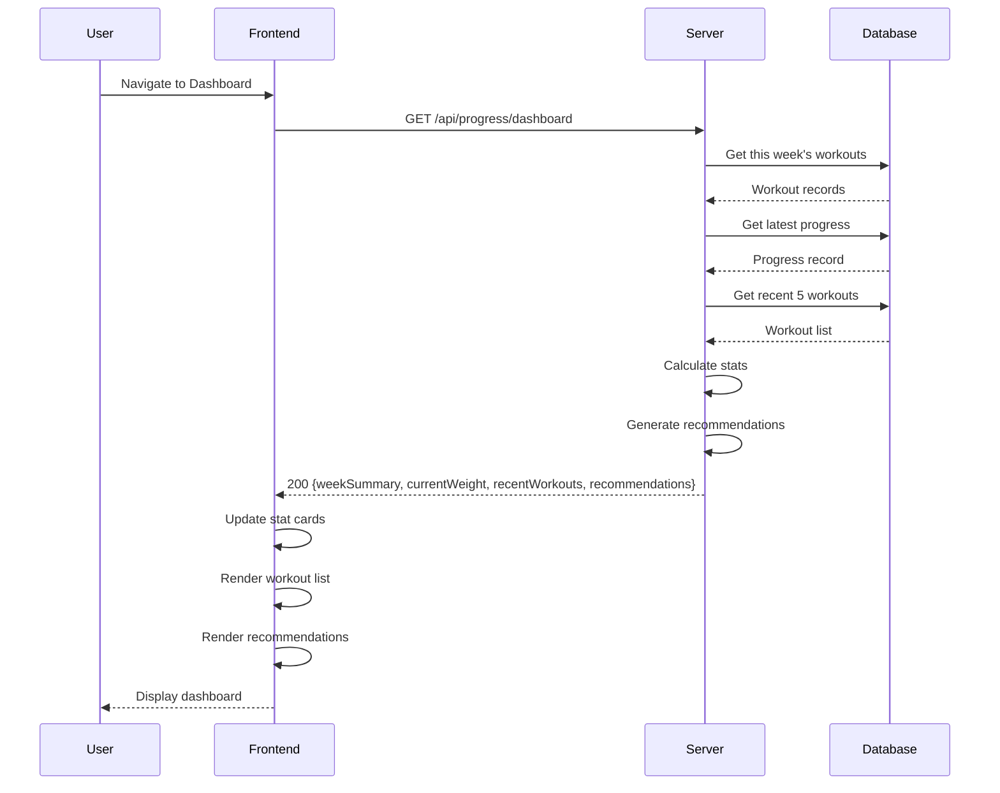
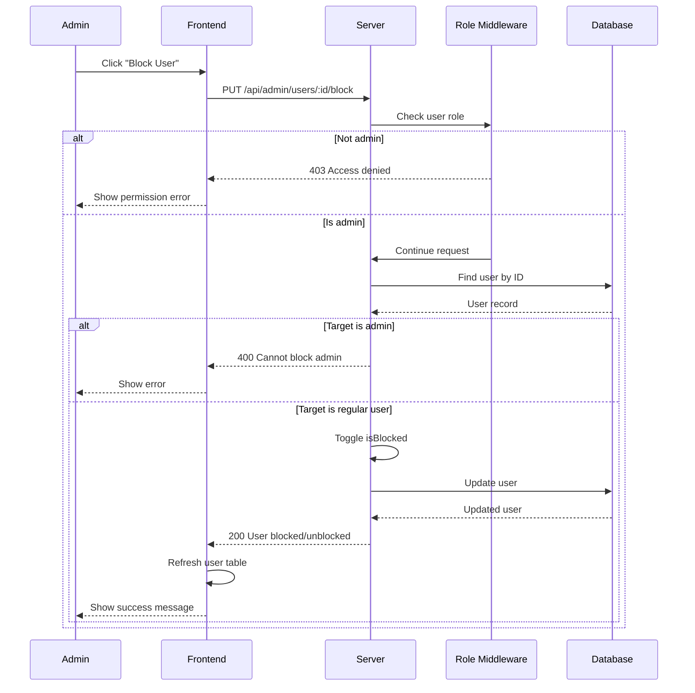
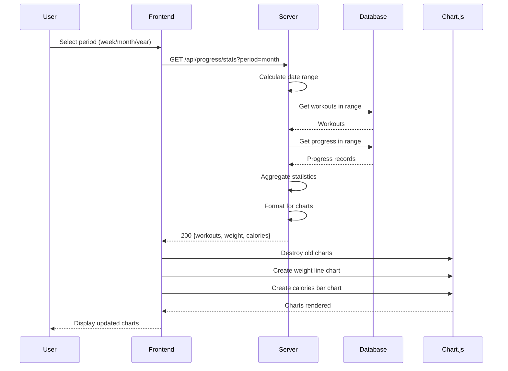

# Sequence Diagrams

## 1. User Registration Flow

## 2. User Login Flow

## 3. Add Workout Flow

## 4. Goal Progress Update Flow

## 5. Dashboard Load Flow

## 6. Admin Block User Flow

## 7. Progress Chart Update Flow

