# Use Case Diagram

## Fitness Tracker Application

```mermaid
graph TB
    subgraph Actors
        User((User))
        Admin((Admin))
    end
    
    subgraph Authentication
        UC1[Register Account]
        UC2[Login]
        UC3[Logout]
        UC4[Update Profile]
        UC5[Change Password]
    end
    
    subgraph Workouts
        UC6[View Workouts]
        UC7[Add Workout]
        UC8[Edit Workout]
        UC9[Delete Workout]
        UC10[Filter Workouts]
    end
    
    subgraph Goals
        UC11[View Goals]
        UC12[Create Goal]
        UC13[Update Goal Progress]
        UC14[Delete Goal]
    end
    
    subgraph Progress
        UC15[View Dashboard]
        UC16[Record Weight]
        UC17[View Charts]
        UC18[View Statistics]
    end
    
    subgraph Administration
        UC19[View All Users]
        UC20[Block/Unblock User]
        UC21[Delete User]
        UC22[View Platform Stats]
    end
    
    User --> UC1
    User --> UC2
    User --> UC3
    User --> UC4
    User --> UC5
    
    User --> UC6
    User --> UC7
    User --> UC8
    User --> UC9
    User --> UC10
    
    User --> UC11
    User --> UC12
    User --> UC13
    User --> UC14
    
    User --> UC15
    User --> UC16
    User --> UC17
    User --> UC18
    
    Admin --> UC19
    Admin --> UC20
    Admin --> UC21
    Admin --> UC22
    
    Admin -.->|inherits| User
```

## Use Case Descriptions

### UC1: Register Account
- **Actor**: User
- **Precondition**: User has no account
- **Main Flow**: User enters email, password, name, and optional profile details
- **Postcondition**: New account created, user logged in

### UC2: Login
- **Actor**: User
- **Precondition**: User has an account
- **Main Flow**: User enters email and password
- **Postcondition**: User receives JWT token, redirected to dashboard

### UC7: Add Workout
- **Actor**: User
- **Precondition**: User is logged in
- **Main Flow**: User selects workout type, enters duration, calories, date, notes
- **Postcondition**: Workout saved to database

### UC12: Create Goal
- **Actor**: User
- **Precondition**: User is logged in
- **Main Flow**: User selects goal type, sets target, unit, deadline
- **Postcondition**: Goal created with progress tracking

### UC15: View Dashboard
- **Actor**: User
- **Precondition**: User is logged in
- **Main Flow**: System displays weekly summary, recommendations, recent workouts
- **Postcondition**: User sees fitness overview

### UC20: Block/Unblock User
- **Actor**: Admin
- **Precondition**: Admin is logged in
- **Main Flow**: Admin toggles user's blocked status
- **Postcondition**: User access is restricted/restored
